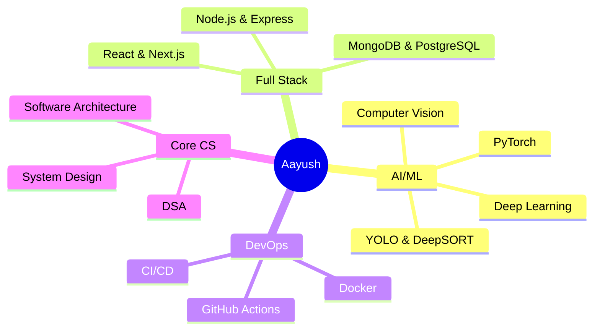

<div align="center">


<h3>
  
</h3>

<br>

```python
class Developer:
    def __init__(self):
        self.name = "Aayush Shrivastav"
        self.role = "CSE Student | Aspiring AI Engineer"
        self.language_spoken = ["hi_IN", "en_US"]
        self.code = ["Python", "JavaScript", "TypeScript", "C++"]
        self.tools = ["React", "Node.js", "PyTorch", "Docker"]
        self.architecture = ["Microservices", "MVC", "Event-Driven"]
        
    def current_focus(self):
        return {
            "learning": ["Computer Vision", "LLMs", "System Design"],
            "building": ["AI Systems", "Full-Stack Apps"],
            "goal": "Creating impactful tech solutions 🎯"
        }
```

<p align="center">
  <a href="https://www.linkedin.com/in/aayush2209/"></a>
  <a href="mailto:ashrivastav2209@gmail.com"></a>
  <a href="https://github.com/Aayush9808"></a>
  <a href="https://drive.google.com/file/d/1TfUbLmOzSFPWrvSi3Y2WF71FOqJMP2JA/view?usp=sharing"></a>
</p>


</div>

<br>


##  About Me


🎓 **Computer Science Engineering** student at **G.L. Bajaj Institute of Technology**

💡 Passionate about building **scalable AI systems** and **full-stack applications** that solve real-world problems

🔭 Currently working on **Computer Vision** projects with YOLO & DeepSORT, and building intelligent automation systems

🌱 Learning **Advanced System Design**, **LLMs**, and **Distributed Systems**

⚡ Fun fact: I believe in "code first, fix later" philosophy (with proper testing, of course! 😄)

<br clear="both">

### 🎯 Quick Highlights

```yaml
Current Focus:
  - 🤖 Building production-grade Computer Vision systems
  - 🏗️ Developing scalable TypeScript/Node.js backends
  - 🧠 Strengthening DSA & System Design fundamentals
  - 🛡️ Exploring AI-powered security & threat detection
  - 🚀 Contributing to impactful open-source projects

2026 Goals:
  - Land an internship at a top tech company
  - Build and deploy 3+ production-ready projects
  - Master advanced AI/ML concepts and LLMs
  - Contribute meaningfully to open-source community
```


##  Tech Stack & Tools

<div align="center">

<table>
<tr>
<td valign="top" width="33%">

#### 💻 Languages
<div align="center">  


</div>

</td>
<td valign="top" width="33%">

#### 🤖 AI/ML
<div align="center">  


</div>

</td>
<td valign="top" width="33%">

#### 🎨 Frontend
<div align="center">  


</div>

</td>
</tr>
<tr>
<td valign="top" width="33%">

#### ⚙️ Backend
<div align="center">  


</div>

</td>
<td valign="top" width="33%">

#### 🗄️ Databases
<div align="center">  


</div>

</td>
<td valign="top" width="33%">

#### 🛠️ DevOps & Tools
<div align="center">  


</div>

</td>
</tr>
</table>

<br>


</div>


##  Featured Projects

<div align="center">

### 🎯 Coding Platform Analyzer

[](https://coding-platform-analyzer.vercel.app)
[](https://github.com/Aayush9808/Coding-Platform-Analyzer)


**Tech Stack:** Python • Flask • Next.js 14 • TypeScript • Tailwind CSS

Automated programming analytics platform aggregating profiles from multiple coding platforms with AI-powered insights, intelligent duplicate detection, and real-time statistics dashboard with RESTful API design.

---

### 🛡️ SentinelAI

[](https://github.com/Aayush9808/SentinelAI)


**Tech Stack:** Python • PyTorch • YOLO • DeepSORT • LSTM • OpenCV

Real-time intelligent video surveillance system with advanced threat detection, LSTM-based anomaly analysis, and multi-camera support capable of processing multiple video streams in real-time for production-grade security.

---

### 📅 Smart Timetable Scheduler

[](https://github.com/Aayush9808/smart-timetable-scheduler)


**Tech Stack:** MongoDB • Express.js • React • Node.js (MERN)

Intelligent scheduling system with automated conflict detection and resolution algorithms. Deployed for 25+ faculty members with role-based access control, reducing manual planning work by 80%+ and saving 15+ hours weekly.

</div>


##  GitHub Analytics

<div align="center">

<table>
<tr>
<td width="50%">


</td>
<td width="50%">


</td>
</tr>
</table>


<br>


<br>


</div>


##  Education & Achievements

<div align="center">

🎓 **B.Tech in Computer Science Engineering**  
📍 G.L. Bajaj Institute of Technology and Management

</div>

| 💫 Achievement | 📝 Description |
|:--------------|:---------------|
| 🤖 **AI/ML Projects** | Built production-grade computer vision and threat detection systems |
| 🏗️ **Full-Stack Development** | Deployed scalable applications serving 25+ users with 80%+ efficiency gains |
| 🎯 **Problem Solving** | Strong foundation in Data Structures & Algorithms |
| 💼 **Real-World Impact** | Projects saving 15+ hours weekly for end users |

<br>

### 🎯 Areas of Expertise




##  Let's Connect

<p align="center">
  
</p>

<p align="center">
  💡 <strong>Open to opportunities</strong> • 🤝 <strong>Collaborations</strong> • 💬 <strong>Tech discussions</strong>
</p>

<div align="center">

[](https://www.linkedin.com/in/aayush2209/)
[](mailto:ashrivastav2209@gmail.com)
[](https://github.com/Aayush9808)
[](https://drive.google.com/file/d/1TfUbLmOzSFPWrvSi3Y2WF71FOqJMP2JA/view?usp=sharing)

<br>


<br>

### 💭 *"Code with purpose. Build with passion. Deploy with pride."*

<br>


</div>
